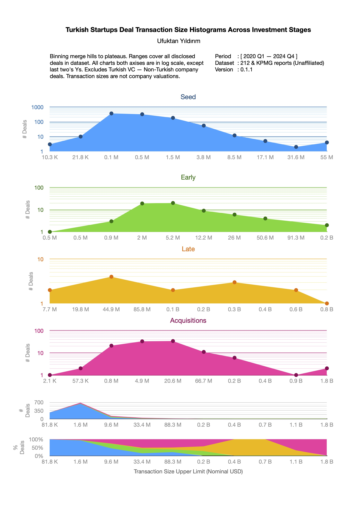

# Startup Landscape in Turkiye

I made those for my own insights and thought others can leverage too. I wanted to focus on SaaS investments at first. Then started with creating histograms for understanding the point where investments concentrate.

**Insights**

Combined with the other observations I made on the actual list of deals:

-   Seed stage shows organic formation with bell-like curve despite constant sized seed programs creating spikes visible in smaller bin sizes.
-   Late stage has "weak" domination on the number of deals in its price range (6th chart) although the overall there are too little data to make any conclusion; compared to two stages sits between.
-   Ticket sizes multiply with 15x going from seed to early and 18x from early to late. Acquisition transaction sizes are smaller than the late stage.
-   Shows startups grow, but funding doesn't.
-   Landscape would look slightly different with adjusting older deals by inflation and dramatically different with different bin sizes.

| Metric                                   | Seed  | Early  | Late  | Acquisition |
| :--------------------------------------- | :---- | :----- | :---- | :---------- |
| Number of disclosed deals                | 966   | 65     | 15    | 111         |
| Total disclosed deal sizes in nominal $  | 0.7 B | 0.7 B  | 3 B   | 5.2 B       |
| Average disclosed deal size in nominal $ | 0.8 M | 10.6 M | 0.2 B | 46.5 M      |

**Tools**

Used Python to plumb data out of PDFs and Numbers to visualize. See my code on [https://github.com/ufukty/landscape/blob/main/scripts/plumb.py](https://github.com/ufukty/landscape/blob/main/scripts/plumb.py)

**Data source**

[https://212.vc/turkish-startup-investment-reviews](https://212.vc/turkish-startup-investment-reviews)
